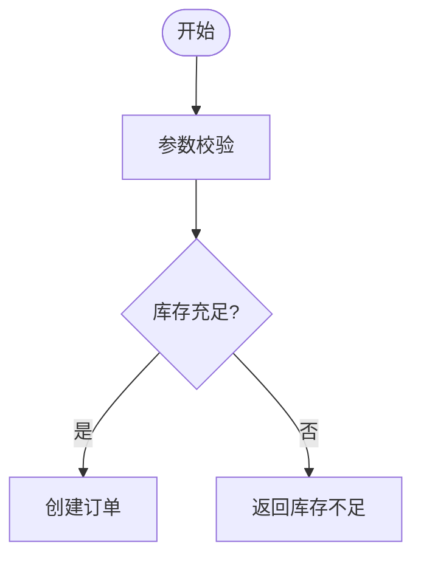
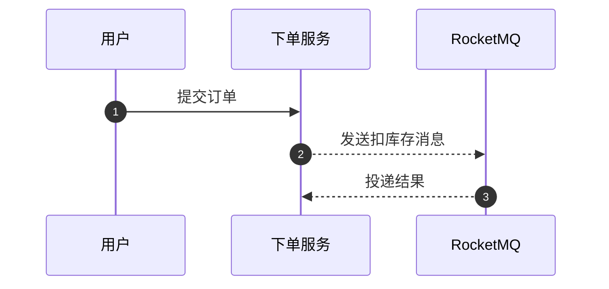
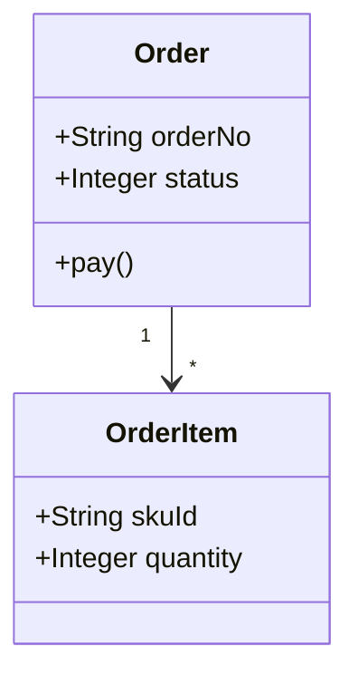

# Mermaid Generation Rules

## Global Rules

- Output one complete Mermaid diagram, not multiple diagrams.
- Use only `flowchart`, `sequenceDiagram`, or `classDiagram`.
- Put the diagram declaration on the first non-comment line.
- Do not use Markdown code fences in `.mmd` files.
- Do not use YAML frontmatter, custom CSS, external images, or HTML-heavy labels.
- Use concise labels. Split overloaded process steps into separate nodes/messages/classes.
- Prefer ASCII IDs such as `Start`, `CheckStock`, `PayCallback`; put Chinese text inside labels.

## Flowchart

Use flowcharts for process orchestration, decision paths, retries, compensation, and fallback flows.

Preferred starts:

```mermaid
flowchart TD
```

```mermaid
flowchart LR
```

Allowed core syntax:



Guidelines:

- Use rectangles for actions, diamonds for decisions, and rounded nodes for start/end.
- Use `subgraph` only when it improves readability.
- Avoid Mermaid's experimental `@{ shape: ... }` syntax because Excalidraw conversion support can lag Mermaid syntax support.
- Keep edges directional and labeled only when the branch condition is meaningful.

## Sequence Diagram

Use sequence diagrams for actor-to-system calls, callbacks, async notifications, and retry flows.

Allowed core syntax:



Guidelines:

- Declare participants explicitly.
- Use `->>` for synchronous requests and `-->>` for async or return messages.
- Use `alt` / `else` / `end` for branches and `loop` / `end` for retries.
- Keep message text short; long descriptions belong outside the diagram.

## Class Diagram

Use class diagrams for domain model sketches, DTO/DO/VO separation, aggregate relationships, and interface contracts.

Allowed core syntax:



Guidelines:

- Keep class names ASCII and put Chinese meaning in comments outside the diagram if needed.
- Prefer `+`, `-`, `#` visibility markers only when they add value.
- Avoid deeply nested generics and long method signatures.
- Use simple relationships: `<|--`, `*--`, `o--`, `-->`, `..>`.
